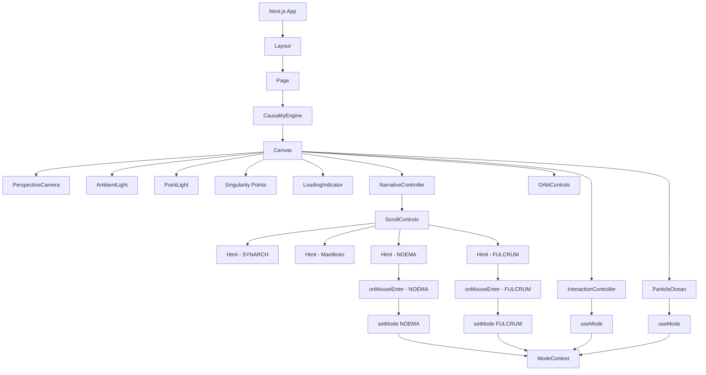

# Component Architecture

## Overview



## Component Hierarchy

```
App (Next.js)
└── Layout
    └── Page
        └── ModeProvider
            └── CausalityEngine
                └── Canvas
                    ├── PerspectiveCamera
                    ├── AmbientLight
                    ├── PointLight
                    ├── Points (Singularity)
                    ├── LoadingIndicator
                    ├── ParticleOcean
                    │   └── Points (500k particles)
                    ├── NarrativeController
                    │   └── ScrollControls
                    │       ├── Html (SYNARCH)
                    │       ├── Html (Manifesto)
                    │       ├── Html (NOEMA)
                    │       └── Html (FULCRUM)
                    ├── InteractionController
                    └── OrbitControls
```

## Data Flow

1. **Initialization Flow**:
   ```
   App → Layout → Page → ModeProvider → CausalityEngine → Canvas
   ```

2. **Phase Transition Flow**:
   ```
   CausalityEngine: initial → useEffect → loading → useEffect → explosion → useEffect → ocean
   ```

3. **Scroll Control Flow**:
   ```
   ScrollControls → useScroll → Html components → opacity changes
   ```

4. **Mode Change Flow**:
   ```
   User Interaction → Html events → setMode → ModeContext → ParticleOcean → color/behavior change
   ```

5. **Animation Flow**:
   ```
   useFrame → Particle positions update → GPU rendering
   ```

## State Management

### Global State (ModeContext)
```typescript
type Mode = 'IDLE' | 'NOEMA' | 'FULCRUM'

interface ModeContextType {
  mode: Mode
  setMode: (mode: Mode) => void
}
```

### Component State (CausalityEngine)
```typescript
type Phase = 'initial' | 'loading' | 'explosion' | 'ocean'

const [phase, setPhase] = useState<Phase>('initial')
```

## Event Handling

### Mouse Events
- `onMouseEnter` / `onMouseLeave` on Html components
- Custom event dispatch for mode changes
- Window-level event listeners for mouse position

### Scroll Events
- Drei's `useScroll` hook
- Custom scroll position tracking
- Opacity transitions based on scroll progress

### Animation Events
- React Three Fiber's `useFrame` hook
- Three.js clock for time-based animations
- Conditional updates based on phase and mode

## Performance Optimization Points

1. **Dynamic Imports**: 3D components only loaded client-side
2. **Buffer Geometries**: Efficient particle storage
3. **useMemo**: Position array generation optimization
4. **Conditional Rendering**: Components only rendered when needed
5. **Event Cleanup**: Proper removal of listeners to prevent memory leaks
6. **AnimationFrame**: Synchronized updates with browser refresh rate